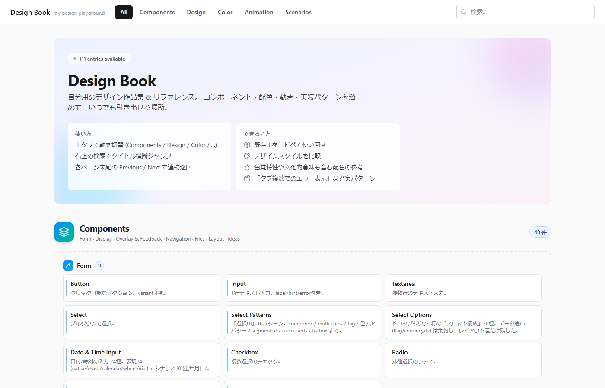
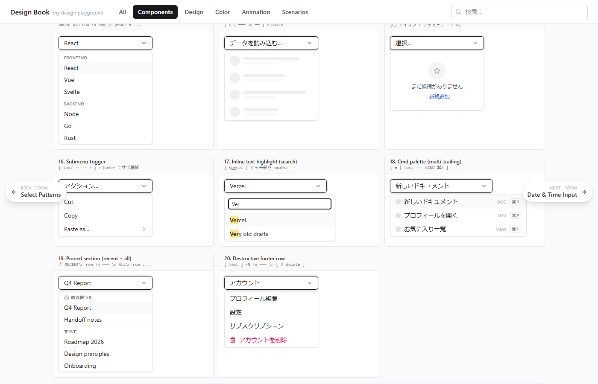
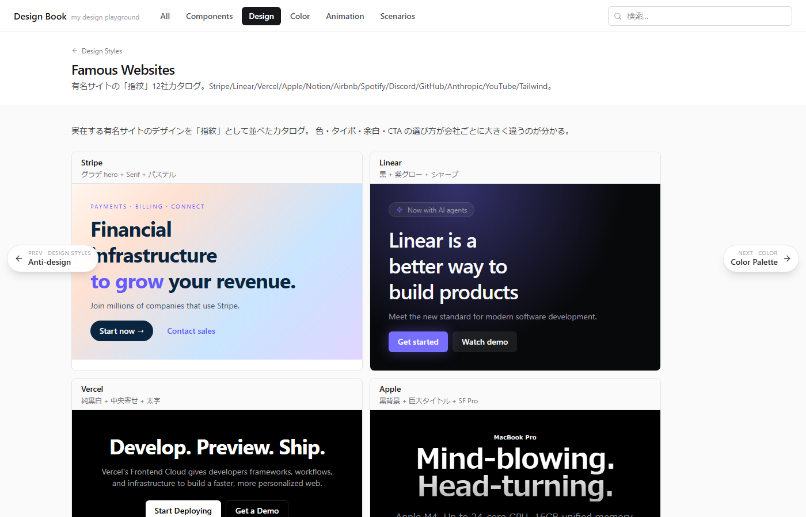
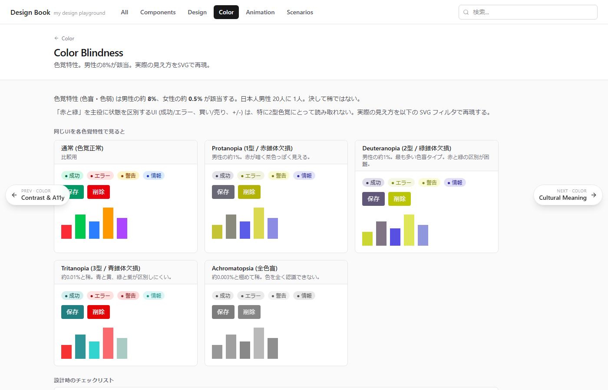
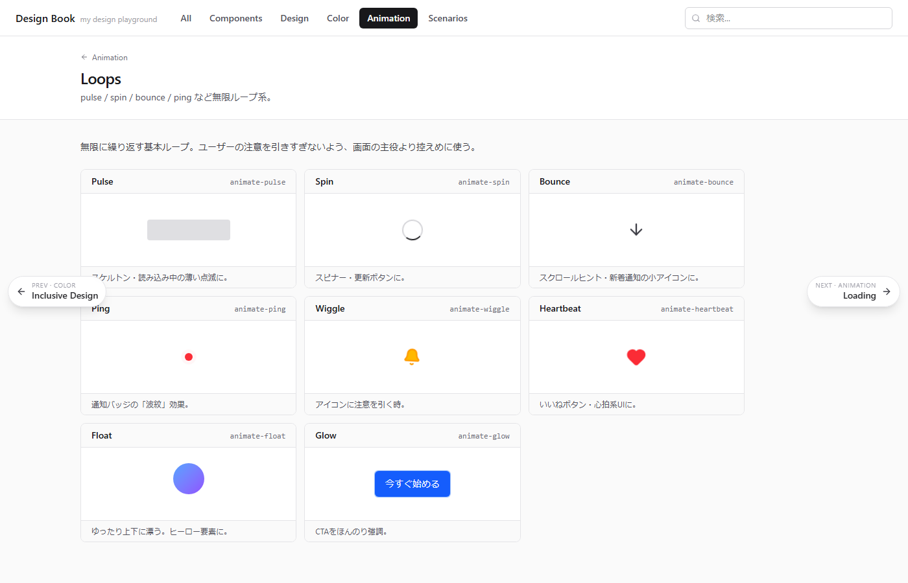
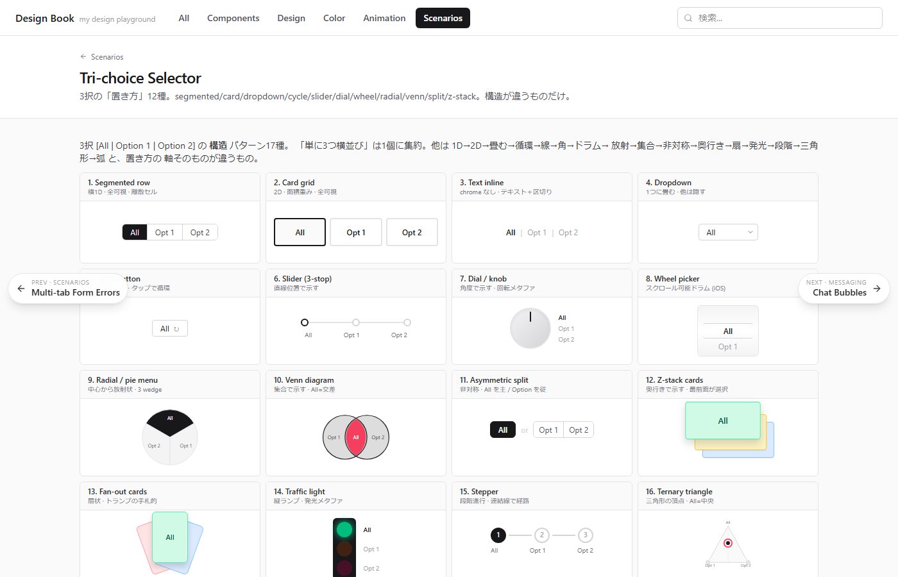
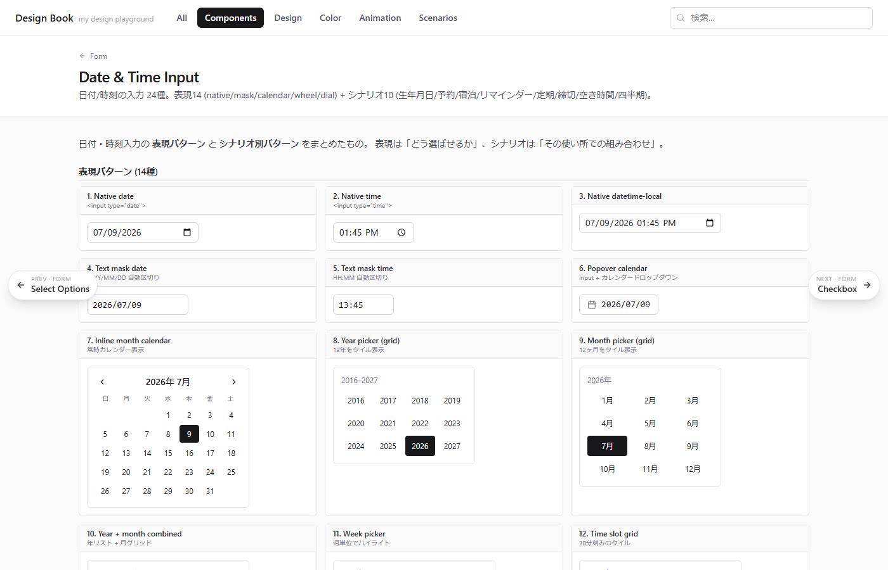

# Design Book

**個人のデザイン参照集**。ボタン・入力欄・色・アニメーション・タイポグラフィから、著名サイトの再現、シチュエーション別の UI パターンまで、
「見比べて選べる」形にまとめた見本帳。

---

## これは何か

デザインの引き出しは、頭の中では 3 個しか思い出せない。ページを開けば 20 個並んでいる — そういう外部記憶。

各項目は静止画ではなく実際に動く UI で、そのままクリック・入力・切り替えができる。

## 何が入っているか

大きく **5 つの軸** で並んでいて、上部タブで切り替える:

| タブ | 中身 |
|---|---|
| **Components** | ボタン / 入力 / セレクト / チェックボックス / タブ / モーダル / テーブル / チャート / マウスエフェクト …110 種 |
| **Design** | Flat / Material / Glassmorphism / Skeuomorphism / Brutalism / Bento / Y2K / Cyberpunk / Frutiger Aero など 32 種のデザイン様式 |
| **Color** | Tailwind パレット、60-30-10 の法則、コントラスト A11y、色覚特性、文化的意味 |
| **Animation** | ループ / ローディング / エントランス / ホバー / マイクロインタラクション / モーダル演出 |
| **Scenarios** | ログイン画面、複数タブでのエラー表示、3択セレクタ、PubMed 論文検索 UI、日付入力 24種 など「使い所」から引ける集 |

## 使ってる場面

- **選択に迷ったとき** — 「並べ替え UI ってどんな見せ方があったっけ」を思い出す
- **参照したいとき** — 有名サイトのデザイン (Stripe / Linear / Notion / Apple 等) を並べて比較
- **説明したいとき** — 色覚特性の見え方や、コントラストの基準値をそのまま見せる
- **ハズし技を探したいとき** — Brutalism / Anti-design / Memphis を眺めて崩し方の下敷きにする

## スクリーンショット

### ホーム
5 つの軸それぞれに、大量のパターンが並ぶ。

### Components — Select Options
1 画面に「これでもか」というくらい変種が並ぶ。ドロップダウンの 1 行内スロット構成だけを 20 種類、
実際に選べる状態で並べたページ。

### Design — Famous Websites
Stripe / Linear / Vercel / Apple / Notion / Airbnb / Spotify / Discord / GitHub / Anthropic /
YouTube / Tailwind の 12 社を、雰囲気そのままで並べたショーケース。

### Color — 色覚特性
男性の約 8% が該当する色覚特性でどう見えるかを SVG フィルタで再現。

### Animation — Loops
pulse / spin / bounce / ping / wiggle / heartbeat / float / glow など、無限ループ系のカタログ。
静止画では伝わらない。ページを開くと全部同時に動いてる。

### Scenarios — 3択セレクタ
「All / Option 1 / Option 2」を出す UI パターン 17 種。segmented・slider・dial・ドラム・Venn・扇状カードなど、
「単に横に並べる」以外の見せ方を集中的に集めた回。

### Scenarios — 日付・時刻入力
表現 14 種 (native input / mask / カレンダー / ドラム / 時計盤) と、
シナリオ 10 種 (生年月日 / 予約 / 宿泊 / リマインダー / 定期スケジュール / 空き時間表 / 四半期 …)。

---

## 参考

すべてのページに「気をつけること」「選ぶ基準」を末尾に付けているので、
ただ眺めるだけでなく、そのパターンをどこで使うと死ぬか / どこで活きるかも一緒に持ち帰れる。
